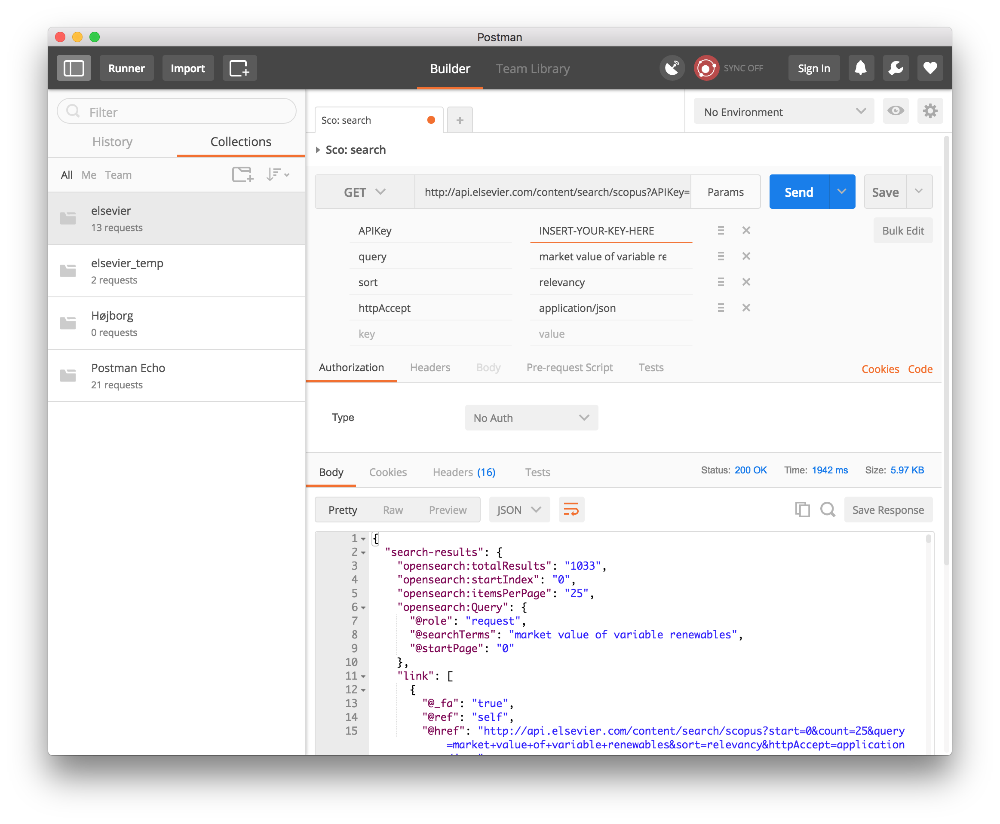

# Preliminary description of methodology

This folder contains the files need to extract data from the Scopus' API, process the data, and finally classify papers based on the network structure. The method primarily uses [Python](https://www.python.org).

## 1. Access to Elsevier Developer Portal and short note on debug tool

First, you need an API key. You can get one by signing up at the [Elsevier Developer Portal](https://dev.elsevier.com/user/login). 

The API key you get, and the data this key gives access to depends on the type of subscription that your institution's has. [See your quota, level of detail, and so on](https://dev.elsevier.com/api_key_settings.html)

The easiest way to test you API key and debugging your API request is to use an API such as [Postman](https://www.getpostman.com). See screenshot below of response from the following request:

    http://api.elsevier.com/content/search/scopus?APIKey=INSERT-YOUR-KEY-HERE&query=market value of variable renewables&sort=relevancy&httpAccept=application/json

## 2. Structure of scripts

Insert you API key in the [`api_key.py`](api_key.py) file. 

Running [`single01.py`](single01.py) will return the JSON files for one particular article (in this case the article with the Scorpus ID `18744367507`). To test your API run this script. It is also doubles as an excellent debug tool.

TO-DO: Clean-up the names of the scripts.

The scripts should be run in the following order. API requests are logged in the folder `log`.

### 2.1 Download data and build network

1. **[`search03a.py`](search03a.py)**: Returns list with search results for specific query. The `param` object contains the query. Currently, the query is set to `TITLE-ABS-KEY("market mechanism" OR "market design") AND TITLE-ABS-KEY(electricity) AND LANGUAGE(english) AND DOCTYPE(ar OR cp OR ch OR re)` which searches for articles containing *market mechanism* or *market design* in addition to containing *electricity* in the key fields (title, abstract, etc). The (initial) search results are limited to articles written in English and are of type *article*, *conference proceeding*, *book chapter* or *review*. See further details in the [API documentation](https://api.elsevier.com/documentation/SCOPUSSearchAPI.wadl) and in [search tips](http://api.elsevier.com/documentation/search/SCOPUSSearchTips.htm).
2. **[`search03b-links.py`](search03b-links.py)**: Goes through each item in the search results and requests the metadata, references (backward propagation) and list of cited-by articles (forward propagation). This part will take a fairly long time to run, since **three** new API requests are sent **for each item** in the initial search result. This part has a (very simple) local cache, such that articles/API requests already sent can be loaded from the cache, rather than being requested again (hence the `local_cache.txt` file `local_cache` folder). 
3. **[`search03c-cleaning2.py`](search03c-cleaning2.py)**: Creates the network/graph from the metadata and data on references and cited-by articles.
4. **TO-DO**: Export at list with the IDs of all articles in the largest component for later use. Current this is done "manually" in [Gephi](https://gephi.org). 
5. **[`search04z-cleaning.py`](search04z-cleaning.py)**: Exports a CSV file of the metadata.

### 2.2 Classification based on network structure

1. **[`test_graph-tool_05.py`](test_graph-tool_05.py)**: Loads the network, filters out anything but the largest component, and creates weights (number of common neighbours).
2. **[`test_graph-tool_05b.py`](test_graph-tool_05b.py)**: Creates an undirected version of the network,
3. **[`test_graph-tool_07c.py`](test_graph-tool_07c.py)**: Classifies each node in the weighted directed network, based on the network structure.

### 2.3 Topic detection of each class

1. **[`topic_detection/topic_c.R`](topic_detection/topic_c.R)**: Using the metadata CSV file and the classification, creates a table with the the top 10 [tf-idf](https://en.wikipedia.org/wiki/Tf–idf) words  appearing in the title or abstract.

